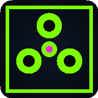

# 🧪 LAB ESCAPE: Outbreak

A neon-soaked, top-down **survival-horror escape game** for mobile. You're trapped
in a containment lab after an outbreak — find **3 keycards**, manage your failing
flashlight, and reach the exit before the **zombies, mutants and creepy insect
swarms** drag you into the dark.

Built as a zero-dependency HTML5 game so it runs instantly in any mobile browser
and installs to the home screen as a **PWA** (Progressive Web App). No app-store
account or build toolchain required to play — and it's ready to wrap as a native
iOS/Android app when you want to ship to the stores.



## 🎮 How to play

| Action | Touch | Keyboard |
| --- | --- | --- |
| Move (RPG-style 8-way) | Left thumbstick | WASD / Arrow keys |
| Sprint (drains battery) | ⚡ button | Shift |
| Toggle flashlight | 🔦 button | F |

**Goal:** Collect all **3 keycards** scattered through the lab, then reach the
glowing **EXIT** door (it stays red-locked until you have every card).

**Survive:**
- 🟢 **Zombies** — slow but relentless, hit hard up close.
- 🟣 **Mutants** — fast, spiky, deal heavy damage.
- 🟠 **Insect swarms** — small, erratic and fast; weak alone, deadly in numbers.
- 🔋 **Batteries** recharge your torch — without light you're nearly blind.
- ❤️ **Medkits** restore health.
- ⏱️ A containment timer ramps the pressure: when it hits zero, everything
  enrages and fresh swarms spill in.

Clear a level to descend **deeper**, where the labs get bigger, darker and more
crowded. Score rewards speed, leftover health and survival time.

## ✨ Features

- **Procedurally generated** labs — a new layout every run.
- **Dynamic lighting & fog-of-war** with a real flashlight cone.
- **Synthesized audio** (Web Audio) — ambient hum, a heartbeat that quickens
  with danger, growls and alarms — with **zero audio files** shipped.
- **Procedural sprites & particles** — no image assets, tiny download.
- **Mobile-first**: virtual joystick, safe-area aware, full-screen, 60 FPS.
- **Installable PWA** with offline support.

## ▶️ Run it locally

It's static files — serve the folder with anything:

```bash
# Python
python3 -m http.server 8080
# or Node
npx serve .
```

Then open `http://localhost:8080` on your phone or desktop. (A server is
recommended over opening `index.html` directly so the service worker / PWA
install works.)

## 🚀 Deploy

Drop the folder on any static host — **Netlify, Vercel, GitHub Pages,
Cloudflare Pages**. No build step. Once it's on HTTPS, mobile visitors get an
**“Add to Home Screen”** prompt and it launches full-screen like a native app.

## 📦 Ship to the App Store / Google Play

The web build is already structured to wrap natively. Recommended path:

```bash
npm install -g @capacitor/cli
npx cap init "Lab Escape" com.yourstudio.labescape --web-dir .
npx cap add ios
npx cap add android
npx cap sync
```

Then open the generated Xcode / Android Studio project to build store binaries.
(Capacitor wraps these exact files in a native shell — touch controls and audio
work as-is.)

## 🗂️ Project structure

```
index.html              # Shell: canvas, HUD, menus, touch controls
styles.css              # Neon UI + responsive mobile layout
manifest.webmanifest    # PWA metadata
sw.js                   # Service worker (offline cache)
icons/                  # App icons (192 / 512)
js/
  utils.js              # Math/collision helpers
  audio.js              # Web Audio synthesis (sfx + ambience)
  input.js              # Virtual joystick + keyboard
  map.js                # Procedural lab generator + collision/LOS
  entities.js           # Player + enemy types (AI, procedural sprites)
  game.js               # State machine, camera, lighting, HUD logic
  main.js               # Bootstrap + game loop + UI wiring
```

## 🛠️ Tuning the game

Want it easier/harder or a different vibe? The knobs live in plain JS:

- Enemy counts & speed: `js/game.js` → `start()`, and `js/entities.js` → `Enemy`.
- Player speed / health / battery drain: `js/entities.js` → `Player`.
- Level timer & scaling: `js/game.js` → `start()`.
- Colors & glow: `styles.css` `:root` variables and the `draw()` methods.

---

Made for fun and built to ship. Survive the lab. 🧟
